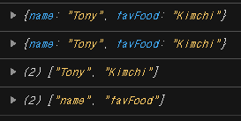
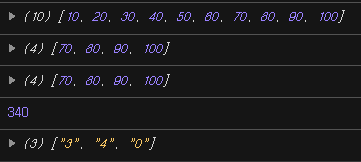
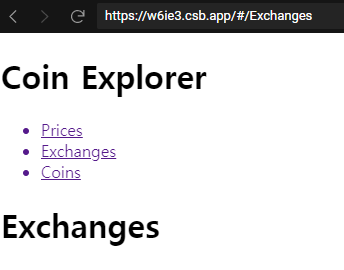
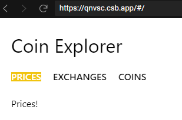
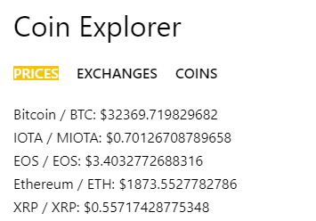
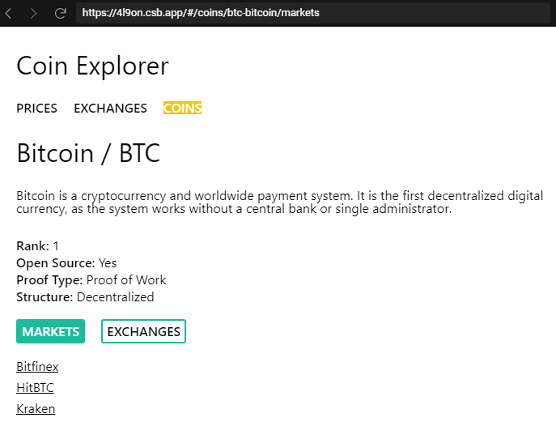
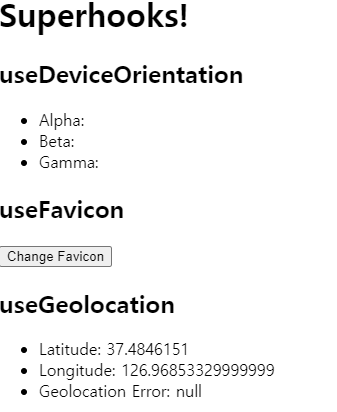

# Nomflix

Learning React and ES6 by building a Movie Discovery App.

## Screens

- [ ] Home
- [ ] TV Shows
- [ ] Search
- [ ] Detail

## API Verbs

- [ ] Now playing (Movie)
- [ ] Upcoming (Movie)
- [ ] Top Rated (TV)
- [ ] Popular (TV, X)
- [ ] Airing Today (TV)
- [ ] TV Show Detail
- [ ] Movie Detail
- [ ] Search (Movie, TV)

## Code Challenges

- [ ] IMDB Link
- [ ] Tabs inside of Movie / Show Details (YT Videos, Production Company & Countries)
- [ ] Collections Link
- [ ] /collections Route
- [ ] On TV Show, show seasons and creators

## Refactoring using hooks

## Deploy

[gh-pages](https://TaehwanGo.github.io/react-movie-app)

- router가 제대로 작동을 안하기 때문에 netlify를 이용해서 배포

[netlify](https://heuristic-panini-e926e4.netlify.app/)

- HashRouter로 변경 후 배포

# Code challenges

## [Day 1](https://codesandbox.io/s/day-one-blueprint-forked-b22qp?file=/src/index.js)



- mergeObjects
- removePassword from an object
- freezeObject
- getOnlyValues
- getOnlyProperties(keys)

## [Day 2](https://codesandbox.io/s/day-two-blueprint-forked-ij4ej?file=/src/index.js)



- Array method : map, filter, reduce, splice
- String method
  - split() : divide a string into an ordered list of substrings

## [Day 3](https://codesandbox.io/s/day-three-blueprint-forked-w6ie3)



- simple page with react router

## [Day 4](https://codesandbox.io/s/day-four-solution-forked-qnvsc?file=/src/Screens/Coins.js)



- simple navbar
  - styled components

```javascript
// router
export default () => {
  return (
    <Router>
      <Header />
      <Route path="/" exact component={Prices} />
      <Route path="/exchanges" component={Exchanges} />
      <Route path="/coins" component={Coins} />
    </Router>
  );
};
// styled component props
const Item = styled.li`
  margin-right: 20px;
  text-transform: uppercase;
  font-weight: 600;
  color: ${props => (props.selected ? 'white' : 'black')};
  background-color: ${props => (props.selected ? '#f1c40f' : 'white')};
`;
```

## [Day 5](https://codesandbox.io/s/day-five-solution-forked-2m3yh?file=/src/index.js)



- simple coin explorer

## [Day 6](https://codesandbox.io/s/day-six-solution-forked-4l9on?file=/src/Screens/Coin/CoinPresenter.js)



```javascript
const CoinPresenter = withRouter(({ location: { pathname }, loading, coin }) =>
  loading ? (
    <Loader />
  ) : (
    <>
      <Title>
        {coin.name} / {coin.symbol}
      </Title>
      <Description>{coin.description}</Description>
      <KeyValueRow>
        <Key>Rank:</Key> <Value>{coin.rank}</Value>
      </KeyValueRow>
      <KeyValueRow>
        <Key>Open Source:</Key> <Value>{coin.open_source ? 'Yes' : 'No'}</Value>
      </KeyValueRow>
      <KeyValueRow>
        <Key>Proof Type:</Key> <Value>{coin.proof_type}</Value>
      </KeyValueRow>
      <KeyValueRow>
        <Key>Structure:</Key> <Value>{coin.org_structure}</Value>
      </KeyValueRow>
      <InsideMenu>
        <List>
          <Item active={pathname === `/coins/${coin.id}/markets`}>
            <Link to={`/coins/${coin.id}/markets`}>Markets</Link>
          </Item>
          <Item active={pathname === `/coins/${coin.id}/exchanges`}>
            <Link to={`/coins/${coin.id}/exchanges`}>Exchanges</Link>
          </Item>
        </List>
      </InsideMenu>
      <Route path="/coins/:id/markets" component={Markets} />
      <Route path="/coins/:id/exchanges" component={Exchanges} />
    </>
  ),
);
```

- nested router

## Day 7



- react hooks(useEffect, useState)
- [submit](https://codesandbox.io/s/day-seven-blueprint-forked-1uhn2?file=/src/index.js)
- [solution](https://codesandbox.io/s/day-seven-solution-forked-g8191?file=/src/index.js)

## [Day 8](https://codesandbox.io/s/day-eight-solution-forked-v8s0l?file=/src/Screens/Coin.js)

- day6 class component to function component(hooks)

## [Day 9](https://codesandbox.io/s/day-nine-solution-forked-isyz4?file=/src/index.js)


- infinite scroll using hooks

```javascript
// App
function App() {
  const [loading, setLoading] = useState(true);
  const [movies, setMovies] = useState([]);
  const page = useInfiniteScroll();
  async function fetchMore() {
    try {
      const {
        data: {
          data: { movies: newMovies },
        },
      } = await getMovies(page);
      const uniqueMovies = [...movies, ...newMovies];
      setMovies(uniqBy(uniqueMovies, 'id'));
    } catch (e) {
      console.log(e);
    }
  }

  async function fetchInitial() {
    try {
      const {
        data: {
          data: { movies },
        },
      } = await getMovies(page);
      setMovies(movies);
    } catch (e) {
      console.log(e);
    } finally {
      setLoading(false);
    }
  }
  useEffect(() => {
    fetchInitial();
  }, []);
  useEffect(() => {
    fetchMore();
  }, [page]);
  return (
    <div>
      <h1>Infinite Movies / Page {page}</h1>
      {loading && <h3>Loading...</h3>}
      {movies &&
        movies.map(movie => (
          <h3 key={`${movie.id}${Date.now()}`}>{movie.title}</h3>
        ))}
    </div>
  );
}
// infinite scroll
export function useInfiniteScroll() {
  const [page, setPage] = useState(1);
  function handleScroll() {
    if (
      document.documentElement.scrollTop + window.innerHeight ===
      document.documentElement.scrollHeight
    ) {
      setPage(p => p + 1);
    }
  }
  useEffect(() => {
    window.addEventListener('scroll', handleScroll);
  }, []);
  return page;
}
```

## 수정사항

2021.07.02

- popular movies를 받아올 때 year가 없는 데이터가 있어서 예외처리 넣음
  - 예외처리해도 되는데 그냥 년월일 다 나오는 게 좋을 것 같아서 전부 표시하는 것으로 수정

<details>
<summary>수정 코드</summary>

```javascript
{
  popular.map(movie => (
    <Poster
      key={movie.id}
      id={movie.id}
      imageUrl={movie.poster_path}
      title={movie.original_title}
      rating={movie.vote_average}
      year={
        movie.release_date ? movie.release_date.substring(0, 4) : '' // 예외 처리 -> movie.release_date 전부표기
      }
      isMovie={true}
    />
  ));
}
```

popular 뿐만 아니라 모든 섹션에 적용

</details>
